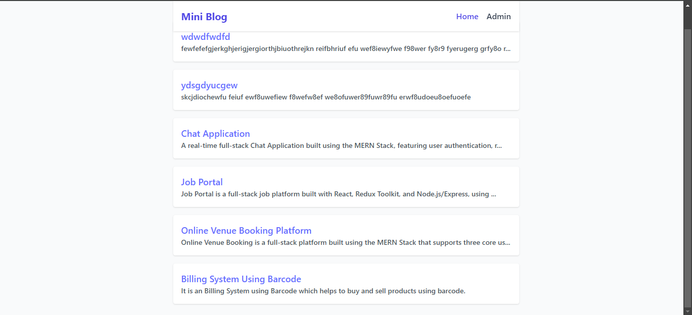

# 🌐 Mini Blog Frontend

This is the **frontend** of the Mini Blog Post Manager built using:

-  React
-  Redux Toolkit
-  React Router
-  TailwindCSS + Shadcn UI
-  Vite

It connects to a REST API backend to manage blog posts with **create**, **read**, **update**, and **delete (CRUD)** operations.

---

## 📁 Folder Structure

- ├── components/         # Reusable UI components (Shadcn/ui)
- ├── pages/              # Route-based pages
- ├── redux/              # Redux Toolkit slice
- ├── App.jsx             # Main app component
- ├── main.jsx            # Entry point

---

## 🚦 Routes

- /Home-----> Displays-----> public blog post listing
- /posts/:id-----> PostDetail-----> Shows details of a single blog post
- /admin-----> Admin-----> Admin panel for creating, editing, deleting posts

---

## 📷 Screenshots

- Home
  

- Post Details
  

- Admin
  

